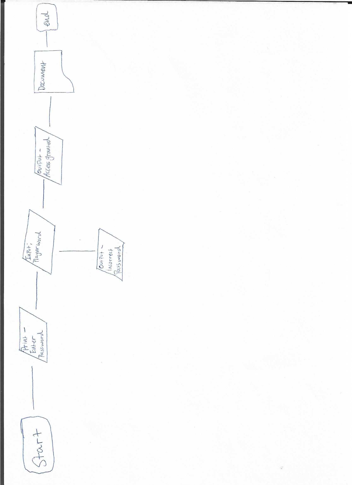

Print Welcome to Terminal 4

Print Password Required

Secret Word = Word Generated from List

While Player Strikes Left < 5

Player Strikes Left = 0

Player Guesses Left = 5 

Similarity = 0 

While Player guesses left < 4

If Player Guesses = word character

Similarity = Similarity + 1

Player Guesses Left = Player Guesses Left + 1

Else if
	Player Guesses Left = Player Guesses + 1
	End If Statement 
End While Statement 

Print out Your guess is similar to password by + Similarity 

If similarity = 6
Print Player Wins
IfElse 
	Player Guesses Left = Player Guesses + 1
End if 
End While

